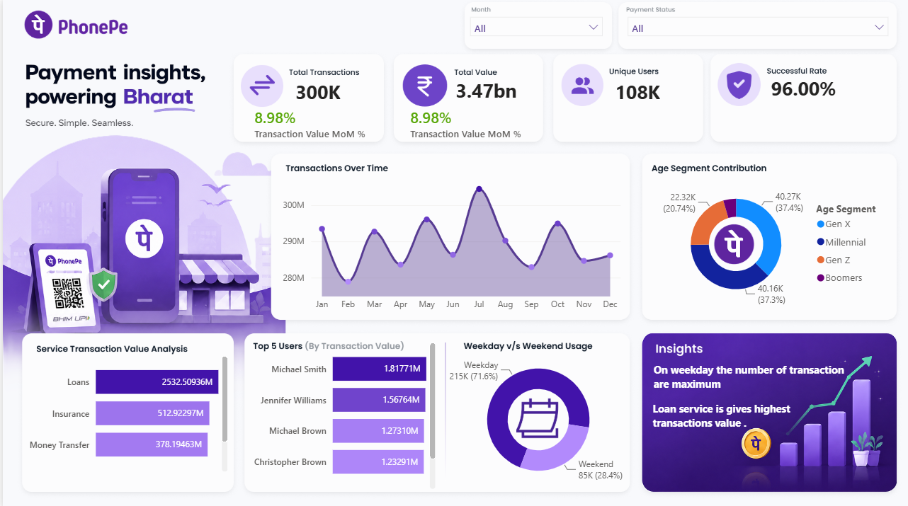

# PhonePe Transaction Analytics Dashboard 📊

An end-to-end Power BI dashboard analyzing 300K+ digital payment transactions to uncover usage trends, service performance, and user behavior patterns for a PhonePe-style fintech platform.



---

## 🔍 Overview

This project simulates a real-world fintech analytics use case — turning raw transaction and user data into an interactive Power BI dashboard that a product/business team could use to track platform health, spot growth trends, and prioritize services.

**Key metrics tracked:**
- Total Transactions: 300K
- Total Transaction Value: ₹3.47Bn
- Unique Users: 108K
- Transaction Success Rate: 96.00%

---

## 📁 Dataset

Two source tables (`Phonepe-Final-Dataset.xlsx`):

| Table | Rows | Columns |
|---|---|---|
| `All_Users` | 110,000+ | User_ID, Name, Age, Join_Date |
| `All_Transactions` | 300,000+ | Transaction_ID, Amount, User_ID, Service, Service Type, Payment_Status, Reason, Date |

**Services covered:** Recharge & Bills (Mobile, DTH, FASTag), Loans, Insurance, Money Transfer
**Derived field:** Age Segment (Gen Z, Millennial, Gen X, Boomers) — bucketed from `Age` for demographic analysis

---

## 🛠️ Tools & Techniques Used

- **Power BI Desktop** — data modeling, DAX measures, visualization
- **Power Query (M)** — data cleaning, transformation, merging Users + Transactions
- **DAX** — calculated measures for MoM growth %, success rate, running totals
- **Data Modeling** — star schema linking `All_Users` and `All_Transactions` on `User_ID`

---

## 📊 Dashboard Features

1. **KPI Summary Cards** — Total Transactions, Total Value, Unique Users, Success Rate (with MoM % growth)
2. **Transactions Over Time** — monthly trend line to spot seasonality/peaks
3. **Age Segment Contribution** — donut chart breaking down transaction share by generation
4. **Service Transaction Value Analysis** — bar chart ranking services (Loans, Insurance, Money Transfer, etc.) by value
5. **Top 5 Users by Transaction Value** — leaderboard view
6. **Weekday vs Weekend Usage** — behavioral split donut chart
7. **Slicers** — filter by Month and Payment Status
8. **Auto-generated Insights panel** — narrative callouts (e.g. weekday peak usage, top-performing service)

---

## 💡 Key Insights

- Weekday transactions account for ~71.6% of volume vs. 28.4% on weekends — usage is driven by routine/utility payments rather than leisure spending.
- **Loan services** generate the highest transaction value among all service categories, ahead of Insurance and Money Transfer.
- Millennials and Gen X together drive ~74% of transaction volume, PhonePe's core user base.
- Platform maintains a consistently high 96% transaction success rate.

---

## 🚀 How to Use

1. Clone this repo
2. Open `PhonePe_Analysis.pbix` in Power BI Desktop (free download from Microsoft)
3. If prompted, update the data source path to point to `data/Phonepe-Final-Dataset.xlsx` on your machine
4. Explore the dashboard using the Month and Payment Status slicers

> Don't have Power BI Desktop? Check the screenshot(s) in `/assets` or the exported PDF for a static view.

---

## 📂 Repository Structure

```
phonepe-transaction-dashboard/
│
├── PhonePe_Analysis.pbix          # Power BI dashboard file
├── data/
│   └── Phonepe-Final-Dataset.xlsx # Source dataset (Users + Transactions)
├── assets/
│   ├── dashboard_preview.png      # Full dashboard screenshot
│   └── dashboard_export.pdf       # Static PDF export (for non-PBI viewers)
├── docs/
│   └── dax_measures.md            # Key DAX formulas used (optional but impressive)
└── README.md
```

---

## 📌 Notes

- This dataset is synthetically generated / anonymized for portfolio purposes and does not represent real PhonePe user data.
- Built as a personal project to practice data modeling, DAX, and dashboard design for fintech/payments analytics.

---

## 👤 Author

**Muskan Kumari**

**Linkedin -** www.linkedin.com/in/muskan-kumari-818789282
**Email -** [musumishra001@gmail.com]
